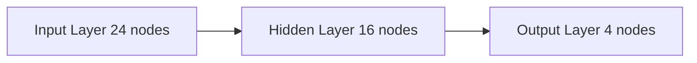

## 2.1 Neural Network Architecture

The neural network serves as the core decision engine of our system, responsible for controlling snake movement behavior and learning capabilities. This section details the network's structural design and operating principles.

### 2.1.1 Network Topology

We employ a three-layer feedforward neural network structure:



#### Input Layer (24 Neurons)
- Visual input from 8 directions
  - Wall distance
  - Food position
  - Self-body position
- 3 different types of observations per direction

#### Hidden Layer (16 Neurons)
- ReLU activation function
- Dynamic weight adjustment
- Adaptive bias values

#### Output Layer (4 Neurons)
- Up, Down, Left, Right movement directions
- Softmax activation function
- Probabilistic decision output

### 2.1.2 Learning Mechanism

The neural network employs the following mechanisms for learning and optimization:

1. **Real-time Weight Adjustment**
   - Based on food collection success rate
   - Considering survival time
   - Dynamic learning rate

2. **Memory System**
   - Short-term memory: Recent N movement states
   - Long-term memory: Persistent storage of successful strategies
   - Experience replay mechanism

3. **Adaptive Optimization**
   - Dynamic difficulty adjustment
   - Reward function optimization
   - Exploration vs exploitation balance

### 2.1.3 Performance Metrics

Network performance is evaluated through the following metrics:

1. **Primary Metrics**
   - Average survival time
   - Food collection efficiency
   - Path optimization level

2. **Secondary Metrics**
   - Decision-making time
   - Memory usage
   - Learning convergence speed

### 2.1.4 Optimization Strategies

To enhance neural network performance, we implement the following optimization strategies:

1. **Weight Initialization**
   - He initialization
   - Avoiding gradient vanishing/explosion

2. **Batch Normalization**
   - Accelerating training process
   - Improving model stability

3. **Dropout Regularization**
   - Preventing overfitting
   - Enhancing generalization capability

### 2.1.5 Technical Implementation

```javascript
class NeuralNetwork {
    constructor(inputNodes, hiddenNodes, outputNodes) {
        this.inputNodes = inputNodes;
        this.hiddenNodes = hiddenNodes;
        this.outputNodes = outputNodes;
        
        // Initialize weight matrices
        this.weightsIH = new Matrix(this.hiddenNodes, this.inputNodes);
        this.weightsHO = new Matrix(this.outputNodes, this.hiddenNodes);
        this.weightsIH.randomize();
        this.weightsHO.randomize();
        
        // Initialize biases
        this.biasH = new Matrix(this.hiddenNodes, 1);
        this.biasO = new Matrix(this.outputNodes, 1);
        this.biasH.randomize();
        this.biasO.randomize();
    }

    // Forward propagation
    feedforward(input_array) {
        // Convert input to matrix
        let inputs = Matrix.fromArray(input_array);
        
        // Calculate hidden layer
        let hidden = Matrix.multiply(this.weightsIH, inputs);
        hidden.add(this.biasH);
        hidden.map(x => Math.max(0, x)); // ReLU activation
        
        // Calculate output layer
        let output = Matrix.multiply(this.weightsHO, hidden);
        output.add(this.biasO);
        output.map(x => 1 / (1 + Math.exp(-x))); // Sigmoid activation
        
        return output.toArray();
    }
}
``` 