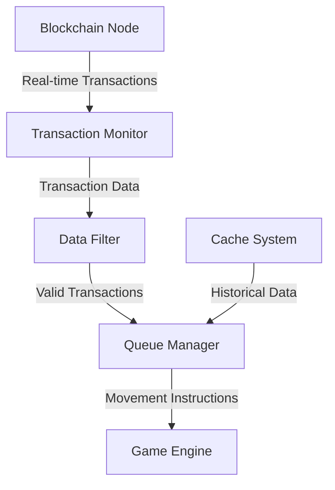

## 2.2 Blockchain Integration

The blockchain integration module is one of our system's innovative features, transforming on-chain transaction data into snake movement instructions, creating a unique fusion of blockchain data and game behavior.

### 2.2.1 Data Flow Architecture



### 2.2.2 Transaction Monitoring System

1. **Data Source Configuration**
   - Solscan API Integration
   - WebSocket Real-time Connection
   - Failure Retry Mechanism

2. **Data Filtering Rules**
   - Transaction Confirmation Requirements
   - Minimum Transaction Amount
   - Address Whitelist

3. **Performance Optimization**
   - Connection Pool Management
   - Data Caching Strategy
   - Batch Processing Mechanism

### 2.2.3 Queue Management System

1. **Queue Characteristics**
   - FIFO (First In First Out) Principle
   - Maximum Queue Length Limit
   - Timeout Handling Mechanism

2. **Movement Instruction Generation**
   - Transaction Hash Conversion Algorithm
   - Direction Mapping Rules
   - Speed Control Logic

3. **State Synchronization**
   - Real-time State Updates
   - Error Recovery Mechanism
   - Data Persistence

### 2.2.4 Technical Implementation

```javascript
class BlockchainMonitor {
    constructor(config) {
        this.apiEndpoint = config.apiEndpoint;
        this.wsEndpoint = config.wsEndpoint;
        this.queue = new Queue(config.maxQueueSize);
        this.cache = new Cache(config.cacheSize);
    }

    // Initialize WebSocket Connection
    async initializeConnection() {
        this.ws = new WebSocket(this.wsEndpoint);
        
        this.ws.onmessage = (event) => {
            const transaction = JSON.parse(event.data);
            if (this.validateTransaction(transaction)) {
                this.processTransaction(transaction);
            }
        };

        this.ws.onerror = this.handleConnectionError.bind(this);
    }

    // Transaction Validation
    validateTransaction(transaction) {
        return (
            transaction.confirmations >= this.minConfirmations &&
            transaction.amount >= this.minAmount &&
            this.isWhitelisted(transaction.address)
        );
    }

    // Movement Instruction Generation
    generateMoveCommand(transaction) {
        const hash = transaction.hash;
        const direction = this.hashToDirection(hash);
        return {
            direction,
            timestamp: Date.now(),
            transactionId: transaction.id
        };
    }

    // Hash to Direction Conversion
    hashToDirection(hash) {
        const value = parseInt(hash.slice(-2), 16);
        const directions = ['up', 'right', 'down', 'left'];
        return directions[value % 4];
    }
}

// Queue Manager
class Queue {
    constructor(maxSize) {
        this.maxSize = maxSize;
        this.items = [];
    }

    enqueue(item) {
        if (this.items.length >= this.maxSize) {
            this.items.shift(); // Remove oldest instruction
        }
        this.items.push(item);
    }

    dequeue() {
        return this.items.shift();
    }

    peek() {
        return this.items[0];
    }
}
```

### 2.2.5 Error Handling

1. **Network Errors**
   - Automatic Reconnection Mechanism
   - Exponential Backoff Algorithm
   - Error Logging

2. **Data Errors**
   - Data Validation
   - Error Data Filtering
   - Abnormal Transaction Handling

3. **System Errors**
   - Graceful Degradation Strategy
   - Backup Mechanism
   - System Recovery Process

### 2.2.6 Monitoring Metrics

1. **Performance Metrics**
   - API Response Time
   - WebSocket Latency
   - Queue Processing Speed

2. **Reliability Metrics**
   - Connection Stability
   - Data Accuracy
   - Error Rate Statistics

3. **Business Metrics**
   - Transaction Processing Volume
   - Instruction Generation Rate
   - System Throughput