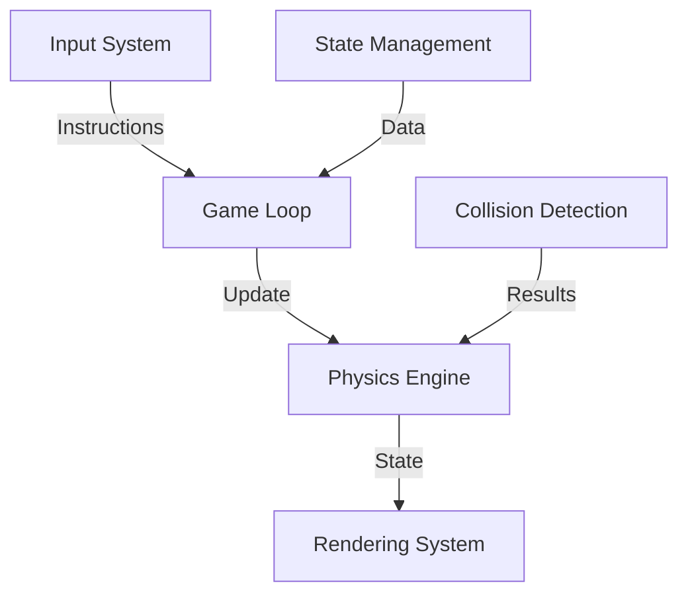

## 2.3 Game Engine

The game engine is the core execution module of the entire system, responsible for handling game logic, physics simulation, and visual rendering. This section details the design and implementation of the game engine.

### 2.3.1 Core Architecture



### 2.3.2 Game Loop

1. **Main Loop Structure**
   - Fixed Time Step
   - State Updates
   - Render Synchronization

2. **Performance Optimization**
   - Frame Rate Control
   - State Caching
   - Render Optimization

### 2.3.3 Physics System

1. **Movement System**
   - Grid-based Movement
   - Speed Control
   - Smooth Transitions

2. **Collision Detection**
   - Boundary Checks
   - Self-collision
   - Food Collision

3. **Food System**
   - Random Generation
   - Position Validation
   - Score Calculation

### 2.3.4 Technical Implementation

```javascript
class GameEngine {
    constructor(config) {
        this.gridSize = config.gridSize;
        this.snake = new Snake();
        this.food = new Food();
        this.score = 0;
        this.isGameOver = false;
        
        // Initialize rendering system
        this.renderer = new Renderer(config.canvas);
        
        // Setup game loop
        this.lastTime = 0;
        this.accumulator = 0;
        this.timeStep = 1000 / 60; // 60 FPS
    }

    // Main game loop
    gameLoop(currentTime) {
        if (this.isGameOver) return;

        const deltaTime = currentTime - this.lastTime;
        this.lastTime = currentTime;
        this.accumulator += deltaTime;

        while (this.accumulator >= this.timeStep) {
            this.update();
            this.accumulator -= this.timeStep;
        }

        this.render();
        requestAnimationFrame(this.gameLoop.bind(this));
    }

    // Update game state
    update() {
        // Update snake position
        this.snake.move();

        // Check collisions
        if (this.checkCollision()) {
            this.isGameOver = true;
            return;
        }

        // Check food
        if (this.checkFoodCollision()) {
            this.snake.grow();
            this.score += 10;
            this.generateNewFood();
        }
    }

    // Collision detection
    checkCollision() {
        const head = this.snake.getHead();
        
        // Boundary collision
        if (this.isOutOfBounds(head)) {
            return true;
        }
        
        // Self collision
        return this.snake.checkSelfCollision();
    }

    // Food collision detection
    checkFoodCollision() {
        const head = this.snake.getHead();
        return head.x === this.food.x && head.y === this.food.y;
    }

    // Generate new food
    generateNewFood() {
        let newPosition;
        do {
            newPosition = {
                x: Math.floor(Math.random() * this.gridSize),
                y: Math.floor(Math.random() * this.gridSize)
            };
        } while (this.snake.occupies(newPosition));
        
        this.food.setPosition(newPosition);
    }
}

// Rendering system
class Renderer {
    constructor(canvas) {
        this.canvas = canvas;
        this.ctx = canvas.getContext('2d');
        this.cellSize = 20;
    }

    render(gameState) {
        this.clear();
        this.drawGrid();
        this.drawSnake(gameState.snake);
        this.drawFood(gameState.food);
        this.drawScore(gameState.score);
    }

    drawGrid() {
        // Draw grid lines
    }

    drawSnake(snake) {
        // Draw snake body
    }

    drawFood(food) {
        // Draw food
    }

    drawScore(score) {
        // Draw score
    }
}
```

### 2.3.5 State Management

1. **Game States**
   - Running State
   - Paused State
   - Game Over State

2. **Data Persistence**
   - Score Records
   - Configuration Saving
   - State Recovery

3. **Event System**
   - State Change Events
   - Collision Events
   - Scoring Events

### 2.3.6 Rendering System

1. **Visual Effects**
   - Grid Rendering
   - Snake Body Effects
   - Food Animation

2. **Performance Optimization**
   - Partial Updates
   - Layer Management
   - Caching Mechanism

3. **UI Components**
   - Score Display
   - Status Panel
   - Debug Information

### 2.3.7 Debug Features

1. **Development Tools**
   - State Inspector
   - Performance Monitor
   - Collision Detection Visualization

2. **Logging System**
   - Error Tracking
   - Performance Logging
   - State Recording

3. **Test Modes**
   - Automated Testing
   - Performance Testing
   - Boundary Testing