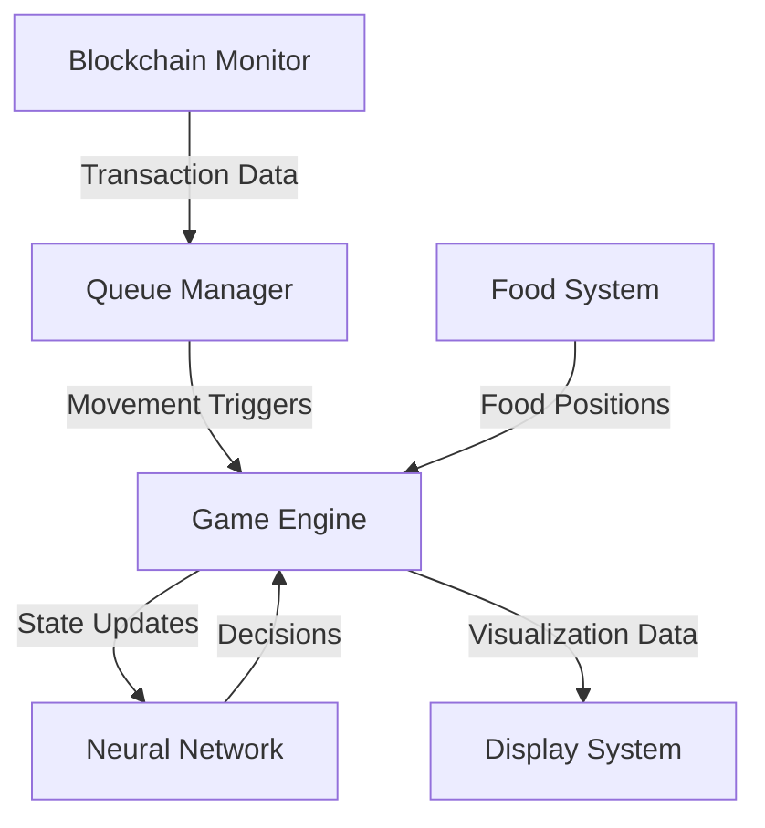

# 2. System Architecture

The Neural Snake AI system is built on a sophisticated architecture that combines neural networks, blockchain integration, and real-time visualization. This section details the core components and their interactions.

## System Overview

## Core Components

### Neural Network Engine
- 24 Input Neurons (8 directions × 3 observations)
- 16 Hidden Layer Neurons
- 4 Output Neurons (movement directions)
- Real-time weight adjustments
- State preservation system

### Blockchain Integration Layer
- Real-time transaction monitoring
- Transaction ID deduplication
- Movement queue management
- Speed control system

### Game Engine
- Physics simulation
- Collision detection
- Food generation
- Score tracking
- State management

### Visualization System
- Neural network state display
- Performance metrics
- Transaction monitoring
- Real-time statistics

## Data Flow

1. **Transaction Processing**
   - Monitor blockchain transactions
   - Filter and deduplicate
   - Queue movement triggers

2. **Game State Management**
   - Update snake position
   - Check collisions
   - Manage food system
   - Track performance

3. **Neural Network Operations**
   - Process environmental inputs
   - Calculate movement decisions
   - Update learning weights
   - Store successful patterns

4. **Visualization Updates**
   - Render game state
   - Update network display
   - Show performance metrics
   - Display transaction data

## Technical Stack

### Frontend
- HTML5 Canvas for rendering
- WebSocket for real-time updates
- Modern JavaScript for UI
- CSS3 for styling

### Backend
- Node.js server
- Express.js framework
- WebSocket server
- Blockchain API integration

### Data Storage
- In-memory game state
- Persistent neural network weights
- Transaction history cache

## System Requirements

### Minimum Requirements
- Modern web browser
- Stable internet connection
- 1Mbps+ bandwidth
- Basic CPU capabilities

### Recommended Setup
- Chrome/Firefox latest version
- 5Mbps+ connection
- Multi-core processor
- Dedicated graphics 