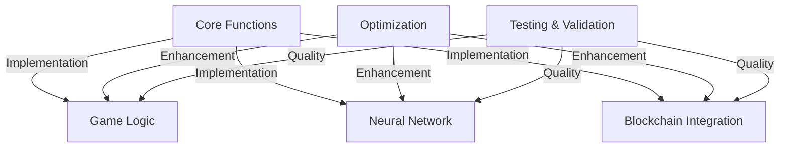

## 3. Technical Implementation

This chapter delves into the technical implementation details of the Neural Snake AI system, focusing on core functionalities and optimization strategies. We'll explore the practical aspects of implementing the theoretical concepts discussed in previous chapters.

### Overview

The technical implementation encompasses several key areas:

### Implementation Principles

1. **Modularity**
   - Loose coupling between components
   - High cohesion within modules
   - Clear interface definitions

2. **Scalability**
   - Horizontal scaling capability
   - Vertical performance optimization
   - Resource efficiency

3. **Maintainability**
   - Clean code practices
   - Comprehensive documentation
   - Version control

4. **Performance**
   - Optimized algorithms
   - Efficient data structures
   - Resource management

### Technology Stack

1. **Frontend Technologies**
   - HTML5 Canvas
   - Modern JavaScript (ES6+)
   - WebSocket for real-time updates

2. **Backend Services**
   - Node.js runtime
   - Express.js framework
   - WebSocket server

3. **External Integrations**
   - Solana blockchain
   - Solscan API
   - Custom APIs

4. **Development Tools**
   - Git for version control
   - npm for package management
   - Jest for testing

### Implementation Strategy

The implementation follows a phased approach:

1. **Phase 1: Core Framework**
   - Basic game mechanics
   - Neural network foundation
   - Data structure setup

2. **Phase 2: Integration**
   - Blockchain connectivity
   - Real-time updates
   - State management

3. **Phase 3: Optimization**
   - Performance tuning
   - Memory management
   - Error handling

4. **Phase 4: Enhancement**
   - UI/UX improvements
   - Additional features
   - Security measures

### Quality Assurance

1. **Testing Methodology**
   - Unit testing
   - Integration testing
   - Performance testing

2. **Code Quality**
   - Code reviews
   - Static analysis
   - Performance profiling

3. **Documentation**
   - API documentation
   - Code comments
   - Technical specifications

The following sections will detail the core functions and optimization strategies implemented in the system. 