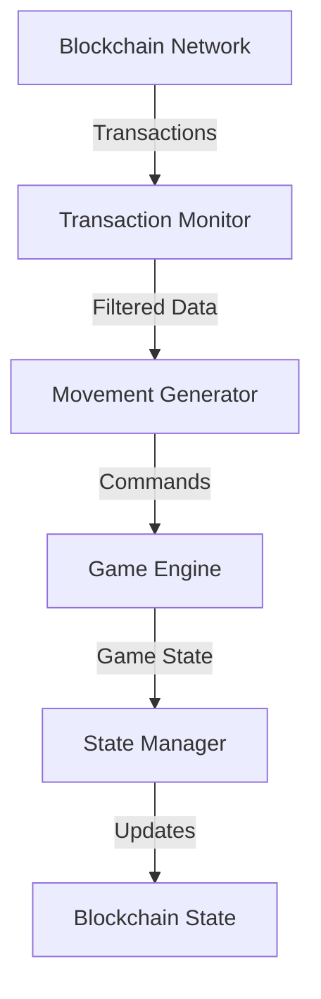

## 4.1 Blockchain Drive System

The Blockchain Drive System represents a groundbreaking approach to controlling game mechanics through blockchain transactions. This section details how we leverage blockchain data to create a unique and dynamic gaming experience.

### 4.1.1 System Architecture



### 4.1.2 Transaction Processing

```javascript
class BlockchainDriver {
    constructor(config) {
        this.solanaConnection = new Connection(config.endpoint);
        this.movementQueue = new PriorityQueue();
        this.lastProcessedSignature = null;
    }

    // Initialize blockchain monitoring
    async initializeMonitoring() {
        try {
            // Subscribe to transaction stream
            this.subscription = this.solanaConnection.onLogs(
                'all',
                (logs) => this.processTransactionLogs(logs)
            );

            // Set up initial state
            await this.syncInitialState();
        } catch (error) {
            console.error('Monitoring initialization failed:', error);
            throw error;
        }
    }

    // Process incoming transaction logs
    async processTransactionLogs(logs) {
        const transactions = logs.map(log => ({
            signature: log.signature,
            timestamp: log.blockTime,
            data: log.logs
        }));

        for (const tx of transactions) {
            if (await this.validateTransaction(tx)) {
                const movement = this.generateMovement(tx);
                this.movementQueue.enqueue(movement);
            }
        }
    }

    // Generate movement from transaction data
    generateMovement(transaction) {
        const hash = transaction.signature;
        const direction = this.hashToDirection(hash);
        
        return {
            direction,
            timestamp: transaction.timestamp,
            signature: transaction.signature,
            priority: this.calculatePriority(transaction)
        };
    }
}
```

### 4.1.3 Movement Generation Algorithm

```javascript
class MovementGenerator {
    // Convert transaction hash to direction
    hashToDirection(hash) {
        const value = BigInt('0x' + hash.slice(0, 16));
        const directions = ['up', 'right', 'down', 'left'];
        return directions[Number(value % 4n)];
    }

    // Calculate movement priority
    calculatePriority(transaction) {
        const age = Date.now() - transaction.timestamp;
        const baseScore = 1000 - Math.min(age, 1000);
        const complexity = this.analyzeTransactionComplexity(transaction);
        
        return baseScore * complexity;
    }

    // Analyze transaction complexity
    analyzeTransactionComplexity(transaction) {
        const instructionCount = transaction.data.length;
        const uniqueAccounts = new Set(transaction.data.map(log => log.account)).size;
        
        return (instructionCount * 0.6 + uniqueAccounts * 0.4) / 10;
    }
}
```

### 4.1.4 State Synchronization

```javascript
class StateManager {
    // Sync game state with blockchain
    async syncGameState(gameState) {
        const stateData = {
            snake: gameState.snake,
            score: gameState.score,
            moves: gameState.moves,
            timestamp: Date.now()
        };

        try {
            // Store state on-chain
            const transaction = await this.createStateTransaction(stateData);
            const signature = await this.sendTransaction(transaction);
            
            // Verify state update
            await this.verifyStateUpdate(signature);
            
            return signature;
        } catch (error) {
            console.error('State sync failed:', error);
            throw error;
        }
    }

    // Create state transaction
    async createStateTransaction(stateData) {
        const instruction = new TransactionInstruction({
            keys: [
                { pubkey: this.statePubkey, isSigner: false, isWritable: true },
                { pubkey: this.payerPubkey, isSigner: true, isWritable: true }
            ],
            programId: this.programId,
            data: Buffer.from(JSON.stringify(stateData))
        });

        return new Transaction().add(instruction);
    }
}
```

### 4.1.5 Performance Optimization

1. **Transaction Filtering**
   ```javascript
   class TransactionFilter {
       // Filter valid transactions
       filterTransactions(transactions) {
           return transactions.filter(tx => 
               this.isRecentTransaction(tx) &&
               this.hasValidFormat(tx) &&
               this.meetsComplexityThreshold(tx)
           );
       }

       // Check transaction recency
       isRecentTransaction(transaction) {
           const maxAge = 5000; // 5 seconds
           return Date.now() - transaction.timestamp < maxAge;
       }

       // Validate transaction format
       hasValidFormat(transaction) {
           return (
               transaction.signature &&
               transaction.data &&
               Array.isArray(transaction.data) &&
               transaction.data.length > 0
           );
       }
   }
   ```

2. **Queue Management**
   ```javascript
   class QueueManager {
       constructor(maxSize = 1000) {
           this.queue = new PriorityQueue();
           this.maxSize = maxSize;
       }

       // Add movement to queue
       enqueue(movement) {
           if (this.queue.size >= this.maxSize) {
               this.pruneOldMovements();
           }
           this.queue.enqueue(movement, movement.priority);
       }

       // Remove old movements
       pruneOldMovements() {
           const now = Date.now();
           while (
               this.queue.size > this.maxSize * 0.8 &&
               now - this.queue.peek().timestamp > 5000
           ) {
               this.queue.dequeue();
           }
       }
   }
   ```

### 4.1.6 Error Handling

```javascript
class ErrorHandler {
    // Handle blockchain errors
    handleBlockchainError(error) {
        const errorLog = {
            timestamp: new Date().toISOString(),
            error: error.message,
            type: this.classifyError(error)
        };

        // Log error
        console.error('Blockchain error:', errorLog);

        // Attempt recovery
        this.attemptRecovery(errorLog.type);

        // Notify monitoring
        this.notifyMonitoring(errorLog);
    }

    // Classify error type
    classifyError(error) {
        if (error.message.includes('timeout')) {
            return 'NETWORK_TIMEOUT';
        } else if (error.message.includes('rate limit')) {
            return 'RATE_LIMIT';
        } else if (error.message.includes('invalid signature')) {
            return 'INVALID_SIGNATURE';
        }
        return 'UNKNOWN';
    }
}
```

### 4.1.7 Security Measures

1. **Transaction Validation**
   - Signature verification
   - Timestamp validation
   - Rate limiting

2. **State Protection**
   - Checksum verification
   - State rollback capability
   - Conflict resolution

3. **Access Control**
   - Program authorization
   - Account permissions
   - Rate limiting

The Blockchain Drive System provides a unique and engaging way to control game mechanics while maintaining security and performance. Its integration with the Solana blockchain ensures transparency and reliability in game operations. 