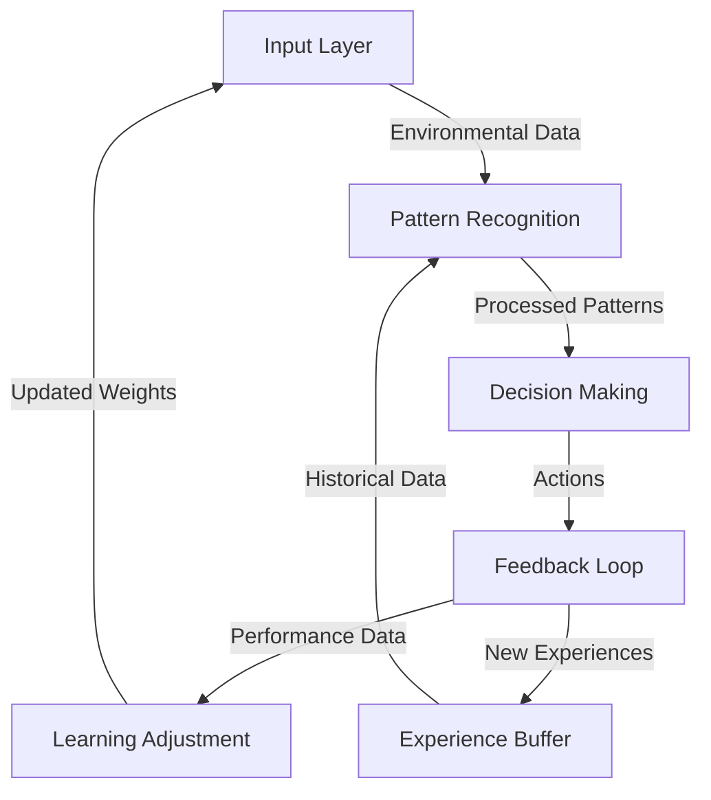

## 4.2 Adaptive Learning

The Adaptive Learning system represents the intelligence core of our Neural Snake AI, implementing sophisticated learning algorithms that enable the snake to improve its performance continuously through experience and pattern recognition.

### 4.2.1 Learning Architecture



### 4.2.2 Pattern Recognition System

```javascript
class PatternRecognition {
    constructor(config) {
        this.patternMemory = new CircularBuffer(config.memorySize);
        this.patternThreshold = config.threshold;
        this.learningRate = config.learningRate;
    }

    // Identify patterns in movement sequences
    identifyPatterns(movements) {
        const patterns = this.extractPatterns(movements);
        const significantPatterns = this.filterSignificantPatterns(patterns);
        return this.rankPatterns(significantPatterns);
    }

    // Extract movement patterns
    extractPatterns(movements, windowSize = 5) {
        const patterns = [];
        for (let i = 0; i <= movements.length - windowSize; i++) {
            const pattern = movements.slice(i, i + windowSize);
            const result = this.analyzePattern(pattern);
            patterns.push(result);
        }
        return patterns;
    }

    // Analyze pattern effectiveness
    analyzePattern(pattern) {
        return {
            sequence: pattern,
            score: this.calculatePatternScore(pattern),
            frequency: this.getPatternFrequency(pattern),
            success_rate: this.calculateSuccessRate(pattern)
        };
    }
}
```

### 4.2.3 Learning Algorithm

```javascript
class AdaptiveLearning {
    constructor(config) {
        this.network = new NeuralNetwork(config.networkStructure);
        this.experienceBuffer = new ExperienceBuffer(config.bufferSize);
        this.learningRate = config.learningRate;
    }

    // Main learning loop
    async learn(gameState) {
        const experience = this.gatherExperience(gameState);
        this.experienceBuffer.add(experience);

        if (this.shouldUpdate()) {
            const batch = this.experienceBuffer.sampleBatch();
            await this.updateNetwork(batch);
        }
    }

    // Gather experience from current game state
    gatherExperience(gameState) {
        return {
            state: this.preprocessState(gameState),
            action: gameState.lastAction,
            reward: this.calculateReward(gameState),
            nextState: this.predictNextState(gameState)
        };
    }

    // Update neural network weights
    async updateNetwork(batch) {
        const targets = this.calculateTargets(batch);
        const loss = await this.network.train(batch.states, targets);
        this.adjustLearningRate(loss);
        return loss;
    }
}
```

### 4.2.4 Dynamic Difficulty Adjustment

```javascript
class DifficultyAdjuster {
    constructor(config) {
        this.metrics = new PerformanceMetrics();
        this.adjustmentRate = config.adjustmentRate;
        this.thresholds = config.thresholds;
    }

    // Adjust difficulty based on performance
    adjustDifficulty(performance) {
        const currentLevel = this.assessPerformance(performance);
        const adjustment = this.calculateAdjustment(currentLevel);
        return this.applyAdjustment(adjustment);
    }

    // Calculate performance metrics
    assessPerformance(data) {
        return {
            averageScore: this.metrics.calculateAverageScore(data),
            survivalTime: this.metrics.calculateSurvivalTime(data),
            efficiencyRate: this.metrics.calculateEfficiencyRate(data)
        };
    }

    // Generate difficulty parameters
    generateParameters(level) {
        return {
            speed: this.calculateSpeed(level),
            reactionTime: this.calculateReactionTime(level),
            patternComplexity: this.calculateComplexity(level)
        };
    }
}
```

### 4.2.5 Experience Management

```javascript
class ExperienceBuffer {
    constructor(maxSize) {
        this.buffer = new CircularBuffer(maxSize);
        this.priorityQueue = new PriorityQueue();
    }

    // Add new experience
    add(experience) {
        const priority = this.calculatePriority(experience);
        this.buffer.push(experience);
        this.priorityQueue.enqueue(experience, priority);
    }

    // Sample batch of experiences
    sampleBatch(batchSize = 32) {
        const batch = [];
        const priorities = [];

        while (batch.length < batchSize) {
            const experience = this.priorityQueue.dequeue();
            if (experience) {
                batch.push(experience);
                priorities.push(experience.priority);
            }
        }

        return { batch, priorities };
    }

    // Calculate experience priority
    calculatePriority(experience) {
        const reward = experience.reward;
        const novelty = this.calculateNovelty(experience);
        const rarity = this.calculateRarity(experience);
        
        return (reward * 0.4 + novelty * 0.3 + rarity * 0.3);
    }
}
```

### 4.2.6 Performance Analysis

```javascript
class PerformanceAnalyzer {
    constructor() {
        this.metrics = {
            scores: new MovingAverage(100),
            survival: new MovingAverage(100),
            efficiency: new MovingAverage(100)
        };
    }

    // Analyze performance trends
    analyzeTrends(data) {
        const trends = {
            score: this.analyzeTrend(data.scores),
            survival: this.analyzeTrend(data.survival),
            efficiency: this.analyzeTrend(data.efficiency)
        };

        return {
            trends,
            recommendations: this.generateRecommendations(trends)
        };
    }

    // Generate improvement recommendations
    generateRecommendations(trends) {
        const recommendations = [];

        if (trends.score.slope < 0) {
            recommendations.push({
                aspect: 'scoring',
                suggestion: 'Focus on food collection efficiency',
                priority: 'high'
            });
        }

        if (trends.survival.slope < 0) {
            recommendations.push({
                aspect: 'survival',
                suggestion: 'Improve collision avoidance',
                priority: 'high'
            });
        }

        return recommendations;
    }
}
```

### 4.2.7 Optimization Techniques

1. **Memory Optimization**
   - Experience replay buffer
   - Priority-based sampling
   - Efficient state representation

2. **Learning Optimization**
   - Batch normalization
   - Gradient clipping
   - Learning rate scheduling

3. **Performance Optimization**
   - Parallel processing
   - GPU acceleration
   - Asynchronous updates

The Adaptive Learning system continuously evolves and improves the snake's behavior through sophisticated pattern recognition and learning algorithms, creating an increasingly challenging and engaging experience for users. 