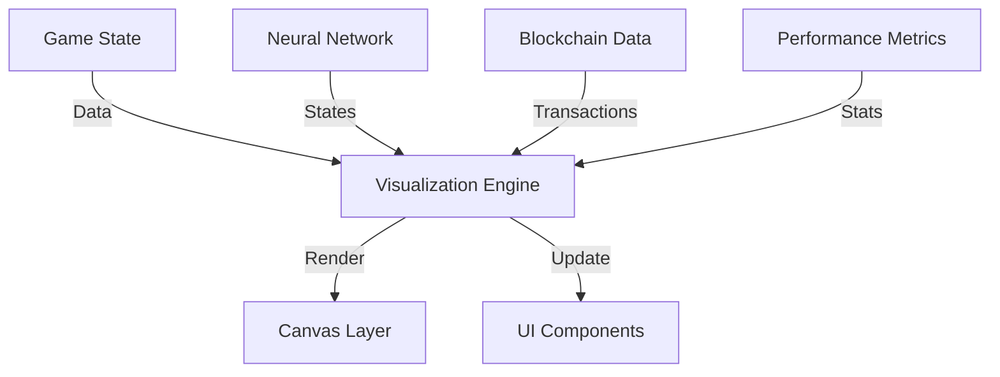

## 4.3 Visualization System

The Visualization System provides real-time insights into the Neural Snake AI's operation, offering intuitive representations of neural network states, performance metrics, and blockchain interactions.

### 4.3.1 System Architecture



### 4.3.2 Neural Network Visualization

```javascript
class NetworkVisualizer {
    constructor(canvas, network) {
        this.canvas = canvas;
        this.ctx = canvas.getContext('2d');
        this.network = network;
        this.layout = this.calculateLayout();
    }

    // Render neural network structure
    renderNetwork() {
        this.clear();
        this.drawLayers();
        this.drawConnections();
        this.drawNodes();
        this.drawWeights();
    }

    // Draw network layers
    drawLayers() {
        const layers = [
            this.network.inputLayer,
            this.network.hiddenLayer,
            this.network.outputLayer
        ];

        layers.forEach((layer, i) => {
            const x = this.layout.layerX[i];
            layer.forEach((node, j) => {
                const y = this.layout.nodeY[i][j];
                this.drawNode(x, y, node.activation);
            });
        });
    }

    // Animate network activity
    animateActivation(inputData) {
        const frames = this.calculateActivationFrames(inputData);
        this.animationLoop(frames);
    }
}
```

### 4.3.3 Performance Metrics Display

```javascript
class MetricsVisualizer {
    constructor(container) {
        this.container = container;
        this.charts = this.initializeCharts();
        this.metrics = new PerformanceMetrics();
    }

    // Initialize chart components
    initializeCharts() {
        return {
            score: new LineChart({
                container: 'score-chart',
                title: 'Score History',
                color: '#2196F3'
            }),
            survival: new LineChart({
                container: 'survival-chart',
                title: 'Survival Time',
                color: '#4CAF50'
            }),
            efficiency: new LineChart({
                container: 'efficiency-chart',
                title: 'Movement Efficiency',
                color: '#FFC107'
            })
        };
    }

    // Update metrics display
    updateMetrics(gameState) {
        const metrics = this.metrics.calculate(gameState);
        this.updateCharts(metrics);
        this.updateStatistics(metrics);
    }

    // Generate performance report
    generateReport() {
        const data = this.metrics.getHistoricalData();
        return {
            current: this.calculateCurrentMetrics(data),
            trends: this.analyzeTrends(data),
            predictions: this.generatePredictions(data)
        };
    }
}
```

### 4.3.4 Blockchain Transaction Display

```javascript
class TransactionVisualizer {
    constructor(container) {
        this.container = container;
        this.transactionList = this.initializeList();
        this.transactionMap = new Map();
    }

    // Add new transaction
    addTransaction(transaction) {
        const element = this.createTransactionElement(transaction);
        this.transactionList.appendChild(element);
        this.transactionMap.set(transaction.id, element);
        this.animateTransaction(element);
    }

    // Create transaction element
    createTransactionElement(transaction) {
        const element = document.createElement('div');
        element.className = 'transaction-item';
        element.innerHTML = `
            <div class="transaction-header">
                <span class="transaction-id">${transaction.id.slice(0, 8)}...</span>
                <span class="transaction-time">${this.formatTime(transaction.timestamp)}</span>
            </div>
            <div class="transaction-details">
                <div class="transaction-direction">${transaction.direction}</div>
                <div class="transaction-status">${transaction.status}</div>
            </div>
        `;
        return element;
    }

    // Animate transaction processing
    animateTransaction(element) {
        element.classList.add('processing');
        setTimeout(() => {
            element.classList.remove('processing');
            element.classList.add('completed');
        }, 1000);
    }
}
```

### 4.3.5 Interactive Debug Tools

```javascript
class DebugVisualizer {
    constructor(game) {
        this.game = game;
        this.debugMode = false;
        this.breakpoints = new Set();
    }

    // Toggle debug mode
    toggleDebug() {
        this.debugMode = !this.debugMode;
        this.updateDebugDisplay();
    }

    // Add debug information
    addDebugInfo(info) {
        if (!this.debugMode) return;

        const debugPanel = document.getElementById('debug-panel');
        const infoElement = document.createElement('div');
        infoElement.className = 'debug-info';
        infoElement.textContent = JSON.stringify(info, null, 2);
        debugPanel.appendChild(infoElement);
    }

    // Visualize collision detection
    visualizeCollisions() {
        if (!this.debugMode) return;

        const collisions = this.game.getCollisionData();
        this.drawCollisionPoints(collisions);
    }
}
```

### 4.3.6 UI Components

1. **Control Panel**
   ```javascript
   class ControlPanel {
       constructor(container) {
           this.container = container;
           this.controls = this.initializeControls();
       }

       // Initialize control buttons
       initializeControls() {
           return {
               start: this.createButton('Start', this.handleStart),
               pause: this.createButton('Pause', this.handlePause),
               reset: this.createButton('Reset', this.handleReset),
               debug: this.createButton('Debug', this.handleDebug)
           };
       }

       // Create control button
       createButton(label, handler) {
           const button = document.createElement('button');
           button.className = 'control-button';
           button.textContent = label;
           button.addEventListener('click', handler.bind(this));
           this.container.appendChild(button);
           return button;
       }
   }
   ```

2. **Status Panel**
   ```javascript
   class StatusPanel {
       constructor(container) {
           this.container = container;
           this.elements = this.initializeElements();
       }

       // Update status display
       updateStatus(status) {
           this.elements.score.textContent = `Score: ${status.score}`;
           this.elements.moves.textContent = `Moves: ${status.moves}`;
           this.elements.time.textContent = `Time: ${this.formatTime(status.time)}`;
           this.updateHealthIndicator(status.health);
       }

       // Update health indicator
       updateHealthIndicator(health) {
           const indicator = this.elements.health;
           indicator.style.width = `${health}%`;
           indicator.className = `health-indicator ${this.getHealthClass(health)}`;
       }
   }
   ```

### 4.3.7 Animation System

```javascript
class AnimationSystem {
    constructor(canvas) {
        this.canvas = canvas;
        this.ctx = canvas.getContext('2d');
        this.animations = new Map();
    }

    // Add new animation
    addAnimation(id, animation) {
        this.animations.set(id, {
            frames: animation.frames,
            duration: animation.duration,
            currentFrame: 0,
            startTime: performance.now()
        });
    }

    // Update animations
    update(timestamp) {
        this.animations.forEach((animation, id) => {
            const elapsed = timestamp - animation.startTime;
            const progress = elapsed / animation.duration;

            if (progress >= 1) {
                this.animations.delete(id);
            } else {
                const frameIndex = Math.floor(progress * animation.frames.length);
                animation.currentFrame = frameIndex;
                this.drawFrame(animation.frames[frameIndex]);
            }
        });
    }
}
```

The Visualization System provides comprehensive insights into the Neural Snake AI's operation, making complex processes transparent and understandable while offering powerful debugging and monitoring capabilities. 