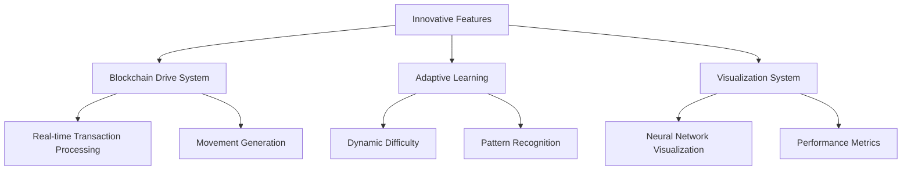

## 4. Innovative Features

This chapter explores the innovative features that distinguish our Neural Snake AI system from traditional implementations. These features combine cutting-edge technologies with novel approaches to create a unique and engaging experience.

### Overview

### Key Innovations

1. **Blockchain Integration**
   - Real-time transaction monitoring
   - Decentralized movement control
   - Transparent decision making

2. **Advanced AI Learning**
   - Adaptive neural networks
   - Pattern-based learning
   - Real-time optimization

3. **Interactive Visualization**
   - Neural network state display
   - Real-time performance metrics
   - Interactive debugging tools

### Innovation Principles

1. **User Experience**
   - Seamless integration
   - Intuitive interface
   - Real-time feedback

2. **Technical Excellence**
   - High performance
   - Scalable architecture
   - Robust error handling

3. **Future-Proofing**
   - Extensible design
   - Modular components
   - Standard compliance

### Implementation Strategy

1. **Phase 1: Foundation**
   - Core feature implementation
   - Basic integration testing
   - Performance baseline

2. **Phase 2: Enhancement**
   - Advanced features
   - Optimization
   - User feedback integration

3. **Phase 3: Refinement**
   - Polish and debugging
   - Performance tuning
   - Documentation

The following sections detail each innovative feature, their implementation, and impact on the system. 