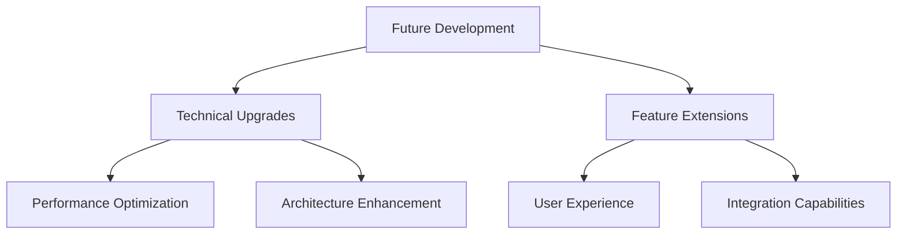

## 5. Future Prospects

This chapter explores the future development directions and potential enhancements for the Neural Snake AI system, outlining our vision for continued innovation and improvement.

### Overview

### Development Roadmap

1. **Short-term Goals (3-6 months)**
   - Performance optimization
   - Bug fixes and stability improvements
   - Minor feature additions

2. **Medium-term Goals (6-12 months)**
   - Major feature implementations
   - Architecture improvements
   - Integration expansions

3. **Long-term Goals (12+ months)**
   - Platform expansion
   - Ecosystem development
   - Research initiatives

### Key Focus Areas

1. **Technical Enhancement**
   - System architecture optimization
   - Performance improvements
   - Security enhancements

2. **User Experience**
   - Interface improvements
   - Accessibility features
   - Mobile support

3. **Integration Capabilities**
   - API expansion
   - Third-party integrations
   - Cross-platform support

### Research Directions

1. **AI Advancement**
   - Advanced learning algorithms
   - Pattern recognition improvements
   - Decision-making optimization

2. **Blockchain Innovation**
   - Smart contract integration
   - Cross-chain compatibility
   - Transaction optimization

3. **System Architecture**
   - Scalability solutions
   - Distributed processing
   - Cloud integration

### Community Engagement

1. **Open Source Development**
   - Code contribution guidelines
   - Documentation improvements
   - Community feedback integration

2. **Educational Resources**
   - Tutorial development
   - Documentation expansion
   - Sample implementations

3. **Collaboration Opportunities**
   - Research partnerships
   - Industry collaborations
   - Academic engagement

The following sections detail our technical upgrade plans and feature extension roadmap, providing a comprehensive view of the system's future development direction. 